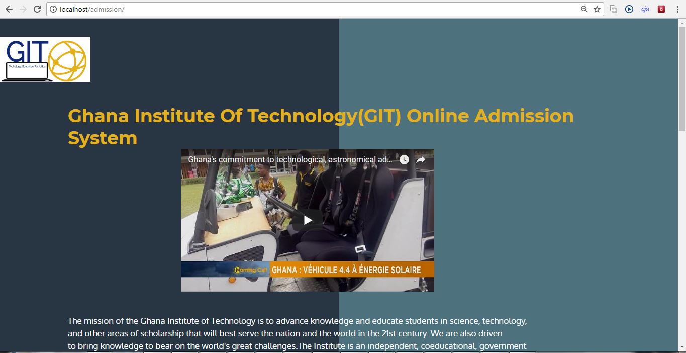
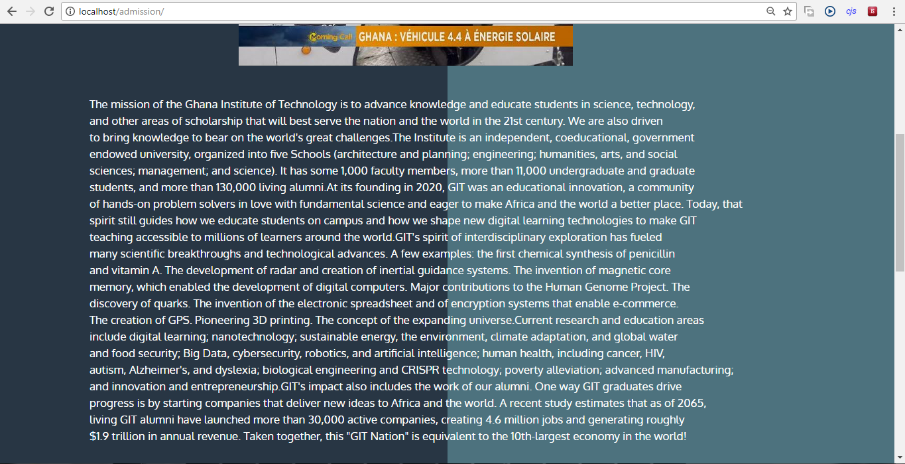
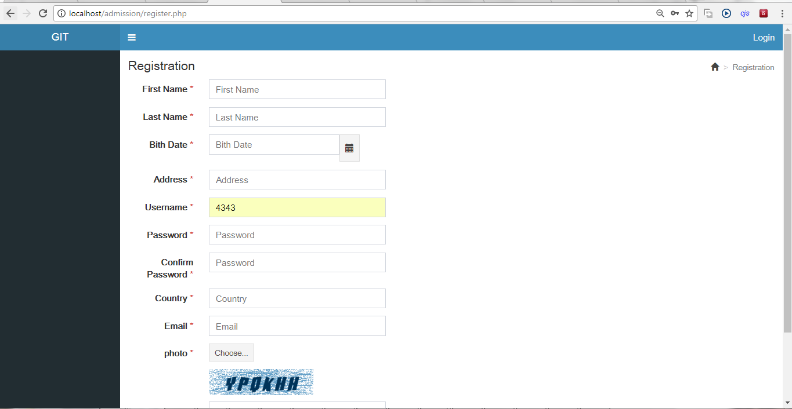
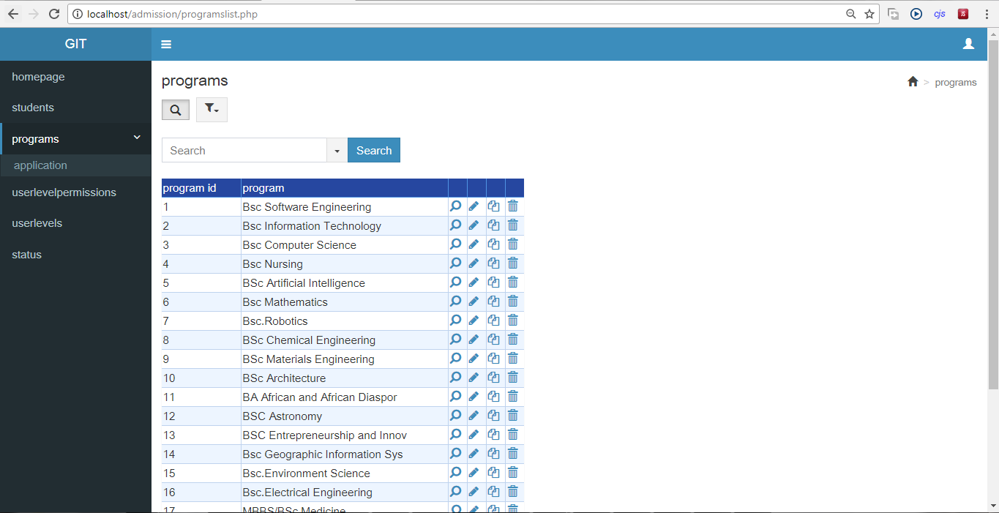

# GIT-Online-Admission-System-PHP-maker
A PHP Maker web application
Website:http://ghanainstituteoftechnology.tk/

This project is birth to a semester project work that I did in Internet Enabled Application Systems 
Development. Its an online admission system which I built with PHPMaker. My passion to see Ghana and Africa 
as a whole advance technologically revived the interest in me to develop this application. My hope is that Ghana could 
build an institution just like the Massachusetts Institute of Technology or the Indian Institute Of Technology focused on techological research and also to help transform the African continent.
The following are some of the programs I think we should place emphasis on:

Bsc.Computer Science

Bsc Information Technology

Bsc Software Engineering

Bsc.Computer Engineering

Bsc Mathematics

BSc Artificial Intelligence 

Bsc.Robotics

BSc Chemical Engineering 

BSc Materials Engineering 

Bsc Metallurgical Engineering

Bsc Agricultural Technology

Bsc Shipbuilding and Repair

BSc Architecture 

BA African and African Diaspora Studies

Bsc Aerospace Engineering

BSC Astronomy

BSC Entrepreneurship and Innovation

Bsc Geographic Information Systems

Bsc.Environment Science

Bsc.Electrical Engineering

Bsc.Nursing

MBBS/BSc Medicine

Bsc.Architecture

Bsc.Civil Engineering

Bsc.Geodetic Engineering

Bsc. Business Systems Analysis

# How to Run the application

1.You need a web server like xampp server

2.Import the database

3.Upload the admission folder into your htdoc folder in xampp

4.Install PHP Maker 2018 setup

5.Open the PHP Maker project File

6.Generate Files if you make changes

