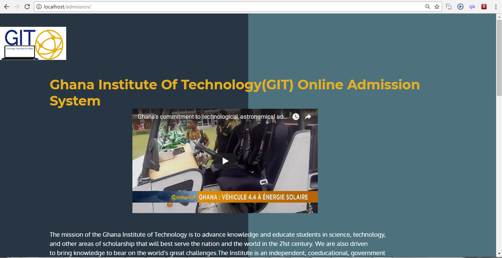
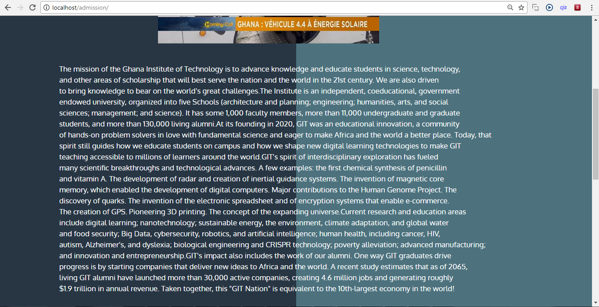
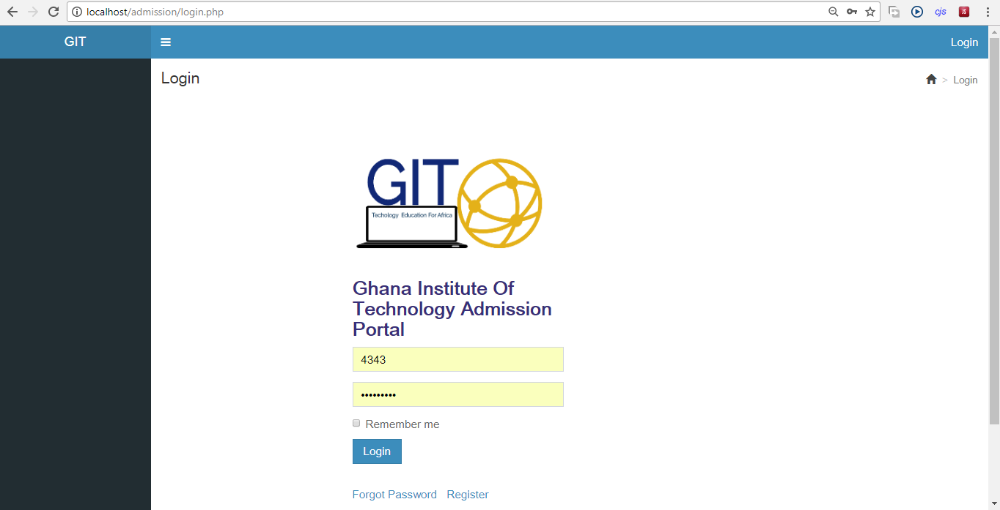
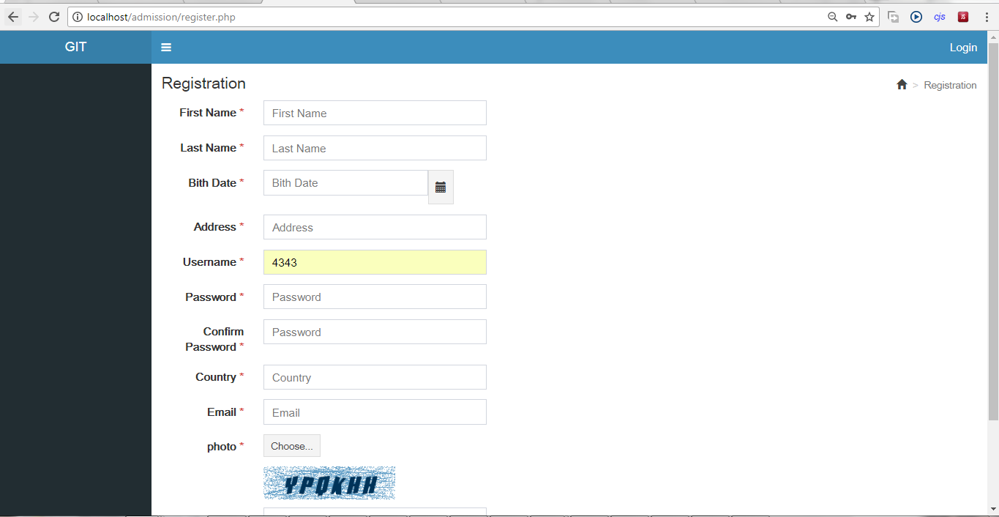
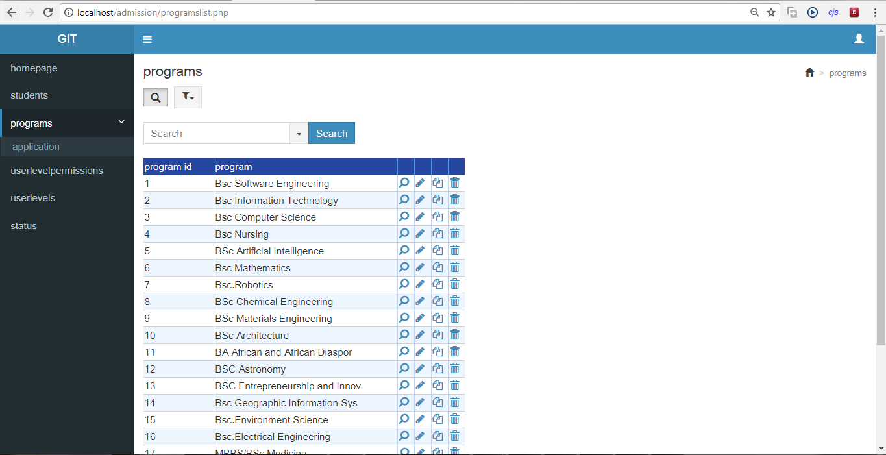

# GIT-Online-Admission-System-PHP-maker
A PHP Maker web application
Website:http://ghanainstituteoftechnology.tk/

<!DOCTYPE html>
<html lang="en">
<head>
  <meta charset="UTF-8">
  <meta name="viewport" content="width=device-width, initial-scale=1.0">
  
  #Ghana Institute of Technology (GIT) Vision
</head>
<body style="font-family: Arial, sans-serif; line-height: 1.6; margin: 40px;">

  <h1>🇬🇭 Ghana Institute of Technology (GIT) Vision</h1>

  

  <h2>🚀 Overview</h2>
  

    This project represents a long-standing vision to see Ghana — and Africa as a whole — advance technologically through the establishment of a world-class institution:
    <strong>Ghana Institute of Technology (GIT)</strong>.
  

  

    Inspired by global institutions like MIT and IIT, GIT is envisioned as a hub for <strong>innovation, research, and design science solutions</strong> that can transform industries and drive national development.
  

  

  <h2>💡 The Inspiration</h2>
  

    About 8 years ago, during my time at Valley View University, I developed a 
    <strong>web-based school course application system (admission system)</strong> using PHP Maker.
  

  

    This was part of a semester project for <em>Internet Enabled Application Systems Development</em>, taught by Mr. Michael Asare.
  

  

    But beyond academics, the project represented something bigger:
  

  
<strong>👉 A prototype system for a futuristic institution — GIT (Ghana Institute of Technology).</strong>

  

  <h2>🏫 The Vision: GIT (Ghana Institute of Technology)</h2>
  
The goal is to build an institution modeled after:

  <ul>
    <li><strong>MIT</strong> – for world-class research and innovation</li>
    <li><strong>IIT</strong> – for scalability, accessibility, and engineering excellence</li>
  </ul>
  

    GIT would focus on <strong>cutting-edge technological education and applied research</strong> to solve real-world problems across Ghana and Africa.
  

  

  <h2>🎓 Key Disciplines</h2>
  <ul>
    <li>Computer Science</li>
    <li>Information Technology</li>
    <li>Software Engineering</li>
    <li>Artificial Intelligence</li>
    <li>Robotics</li>
    <li>Aerospace Engineering</li>
    <li>Materials & Metallurgical Engineering</li>
    <li>Chemical Engineering</li>
    <li>Agricultural Technology</li>
    <li>Environmental Science</li>
    <li>Geographic Information Systems (GIS)</li>
    <li>Electrical & Civil Engineering</li>
    <li>Architecture</li>
    <li>Medicine & Nursing</li>
    <li>Business Systems Analysis</li>
    <li>Entrepreneurship & Innovation</li>
    <li>African & Diaspora Studies</li>
  </ul>

  <h3>⚓ Specialized Focus</h3>
  <ul>
    <li>
      <strong>Shipbuilding & Marine Engineering</strong> 
      Supporting Ghana’s ports and maritime industry with local innovation and industrial capacity.
    </li>
  </ul>

  

  <h2>🌍 The Bigger Goal</h2>
  <ul>
    <li>Tech startups</li>
    <li>Scientific breakthroughs</li>
    <li>Engineering excellence</li>
    <li>Industrial transformation</li>
  </ul>
  
<strong>👉 Ultimately positioning Ghana as a “Silicon Valley of Africa”</strong>

  

  <h2>🖼️ Concept Visualization</h2>
  
The image above illustrates a futuristic GIT campus featuring:

  <ul>
    <li>Shipbuilding & Marine Engineering Lab</li>
    <li>AI and Robotics research</li>
    <li>Aerospace innovation (rockets & drones)</li>
    <li>Smart agriculture systems</li>
    <li>Advanced engineering labs</li>
  </ul>

  

  <h2>🔗 Project Repository</h2>
  

    <a href="https://github.com/solomonyaw/GIT-Online-Admission-System-PHP-maker" target="_blank">
      View Admission System on GitHub
    </a>
  

  

  <h2>🗣️ Let’s Start the Conversation</h2>
  
What would it take to build a world-class institution like GIT in Ghana?

  <ul>
    <li>Government policy?</li>
    <li>Private sector investment?</li>
    <li>Diaspora collaboration?</li>
    <li>Academic partnerships?</li>
  </ul>

  

  <h2>✍️ Author</h2>
  

    <strong>Solomon Yaw Adeklo</strong> 
    IT Specialist | Software Developer | AI Enthusiast | Prompt Engineering Expert
  

</body>
</html>
# How to Run the application

1.You need a web server like xampp server

2.Import the database

3.Upload the admission folder into your htdoc folder in xampp

4.Install PHP Maker 2018 setup

5.Open the PHP Maker project File

6.Generate Files if you make changes

